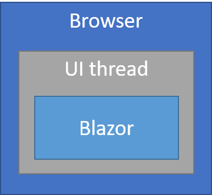

# Blazor hosting models

By [Daniel Roth](https://github.com/danroth27)

[!INCLUDE[](~/includes/blazor-preview-notice.md)]

Blazor is a web framework designed primarily to run in the browser on a WebAssembly-based .NET runtime. Blazor supports multiple hosting models, including an out-of-process hosting model, where the Blazor component logic runs separately from the UI thread. Regardless of the hosting model, the Blazor app and component models *remain the same*. This article discusses the available hosting models for Blazor.

## Client-side hosting model

The principal hosting model for Blazor is running client-side in the browser. In this model, the Blazor app, its dependencies, and the .NET runtime are downloaded to the browser. The app is executed directly on the browser UI thread. All UI updates and event handling happens within the same process. The app assets can be deployed as static files using whatever web server is preferred (see [Host and deploy](xref:client-side/blazor/host-and-deploy/index)).



To create a Blazor app using the client-side hosting model, use the **Blazor** or **Blazor (ASP.NET Core Hosted)** project templates (`blazor` or `blazorhosted` template when using the [dotnet new](/dotnet/core/tools/dotnet-new) command at a command prompt). The included *blazor.webassembly.js* script handles:

* Downloading the .NET runtime, the app, and its dependencies.
* Initialization of the runtime to run the app.

The client-side hosting model offers several benefits. Client-side Blazor:

* Has no .NET server-side dependency.
* Has a rich interactive UI.
* Fully leverages client resources and capabilities.
* Offloads work from the server to the client.
* Supports offline scenarios.

There are downsides to client-side hosting. Client-side Blazor:

* Restricts the app to the capabilities of the browser.
* Requires capable client hardware and software (for example, WebAssembly support).
* Has a larger download size and longer app load time.
* Has less mature .NET runtime and tooling support (for example, limitations in .NET Standard support and debugging).

Visual Studio includes the **Blazor (ASP.NET Core hosted)** project template for creating a Blazor app that runs on WebAssembly and is hosted on an ASP.NET Core server. The ASP.NET Core app serves the Blazor app to clients but is otherwise a separate process. The client-side Blazor app can interact with the server over the network using Web API calls or SignalR connections.

> [!IMPORTANT]
> If a client-side Blazor app is served by an ASP.NET Core app hosted as an IIS sub-app, disable the inherited ASP.NET Core Module handler. Remove the handler in the Blazor app's published *web.config* file by adding a `<handlers>` section to the file:
>
> ```xml
> <handlers>
>   <remove name="aspNetCore" />
> </handlers>
> ```
>
> Set the app base path in the Blazor app's *index.html* file to the IIS alias used when configuring the sub-app in IIS. For more information, see [App base path](xref:client-side/blazor/host-and-deploy/index#app-base-path).

## Server-side hosting model

In the server-side hosting model, Blazor is executed on the server from within an ASP.NET Core app. UI updates, event handling, and JavaScript calls are handled over a SignalR connection.


To create a Blazor app using the server-side hosting model, use the **Blazor (Server-side in ASP.NET Core)** template (`blazorserver` when using [dotnet new](/dotnet/core/tools/dotnet-new) at a command prompt). An ASP.NET Core app hosts the Blazor server-side app and sets up the SignalR endpoint where clients connect. The ASP.NET Core app references the Blazor `Startup` class to add:

* Server-side Blazor services.
* The Blazor app to the request handling pipeline.

[!code-csharp[](hosting-models/samples_snapshot/Startup.cs?highlight=5,27)]

The *blazor.server.js* script&dagger; establishes the client connection. It's the app's responsibility to persist and restore app state as required (for example, in the event of a lost network connection).

The server-side hosting model offers several benefits. Server-side Blazor:

* Allows you to write your entire app with .NET and C# using the Blazor component model.
* Provides a rich interactive feel and avoids unnecessary page refreshes.
* Has a significantly smaller app size than a client-side Blazor app and loads much faster.
* Component logic can take full advantage of server capabilities, including using any .NET Core compatible APIs.
* Runs on .NET Core on the server, so existing .NET tooling, such as debugging, works as expected.
* Works with thin clients (for example, browsers that don't support WebAssembly and resource constrained devices).

There are downsides to server-side hosting. Server-side Blazor:

* Has higher latency: Every user interaction involves a network hop.
* Offers no offline support: If the client connection fails, the app stops working.
* Has reduced scalability: The server must manage multiple client connections and handle client state.
* Requires an ASP.NET Core server to serve the app. Deployment without a server (for example, from a CDN) isn't possible.

&dagger;The *blazor.server.js* script is published to the following path: *bin/{Debug|Release}/{TARGET FRAMEWORK}/publish/{APPLICATION NAME}.App/dist/_framework*.
